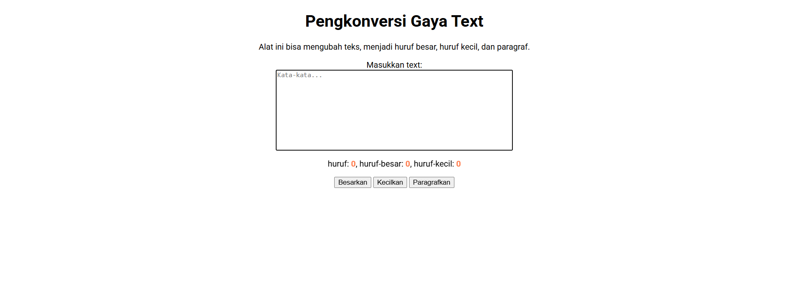
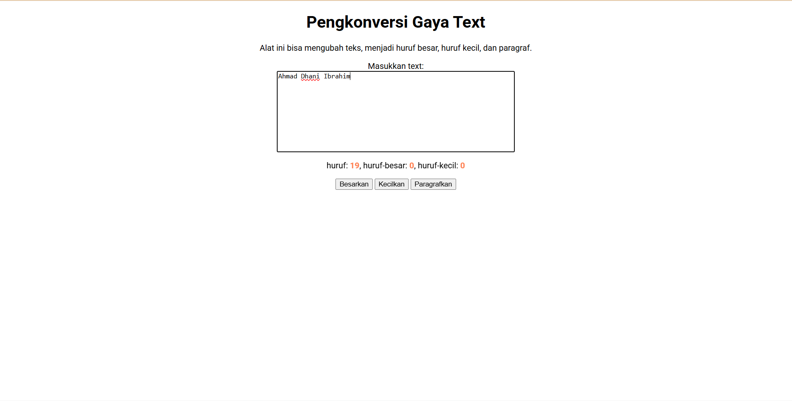

Laporan Tugas Pendahuluan 03

Buatlah tata letak laman yang kamu buat berada di tengah seperti di bawah ini, dan juga ubah font-nya dengan Inconsolata dari Google Fonts.

untuk mengubah tata letak supaya konten berada di tengah maka kita styling di bagian body dan textarea
```css
body {
    text-align: center;
}

textarea{
    display: block;
    margin:auto;
}
```
sumber kode: [index.css]

pada [index.html] supaya program mengenali font insolanta dari google, maka kita harus menambahkan kode tersebut di bagian head.
```html
 <link href="https://fonts.googleapis.com/css2?family=Roboto:ital,wght@0,100..900;1,100..900&display=swap" rel="stylesheet">
 ```
 fungsinya untuk mengakses font insolanta dari google.fonts supaya font dapat digunakan didalam file css.

 Lalu didalam css kita styling body supaya font berubah menjadi insolanta seperti berikut:

 ```css
   body {
    text-align: center;
    font-family: "Roboto", sans-serif;
}
```
sumber code: [index.css]

Maka tampilannya akan menjadi seperti ini


Lalu supaya file JavaScript berfungsi, panggil file tersebut di file html

```html
    <script src="index.js"></script>
```
pada umumnya, tag script diletakkan di akhir sebelum tag </body> supaya elemen html dimuat terlebih dahulu sebelum JavaScript dijalankan.

Maka hasilnya, program akan menghitung jumlah karakter pada teks yang kita ketik


