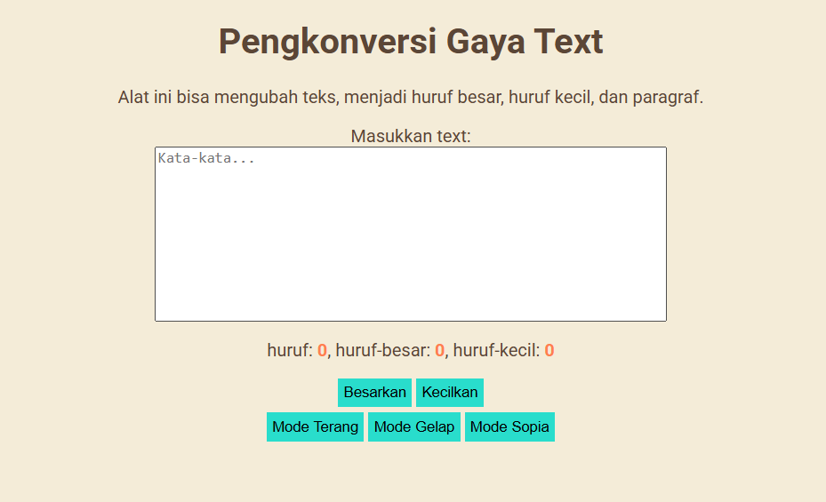

# Tugas Mandiri
**Nama:** Ahmad Dhani Ibrahim
**Kelas:** SE-08-02
**NIM:** 103122400058

##Source code
[index.html](./index.html), [index.css](./index.css), [index.js](./index.js)
## Soal
Tambahkan mode sepia dengan ketentuan:

Elemen	|| Warna
Latar belakang	|| #F4ECD8
Warna teks	|| #5B4636
Biarkan form tetap warna putih.

## Pengerjaan
Pertama, saya menambahkan button baru untuk sopiaMode di file [index.html](/index.html).
```html
<button id="tombol-sopia">Mode Sopia</button>
```

Lalu saya styling [index.css](./index.css) untuk mengubah warna latarbelakang dan button sesuai warna yang ditentukan
```css
.mode-sopia {
    background-color:#F4ECD8;
    color: #5B4636;
}

.mode-sopia  button {
    background-color: #29ddcc;
}   
```
Hubungkan class button yang ada di [index.html](./index.html) 
```js
const buttonSopiaElement = document.getElementById("tombol-sopia");
```

Tambahkan listener supaya saat masing" button diclick, maka akan menampilkan sesuai dengan mode nya
```js
buttonSopiaElement.addEventListener("click", (event) => {
    document.documentElement.classList.remove("mode-gelap");
});

buttonLightElement.addEventListener("click", (event) => {
    document.documentElement.classList.remove("mode-sopia");
});
buttonSopiaElement.addEventListener("click", (event) =>{
    document.documentElement.classList.add("mode-sopia"); 
});

buttonDarkElement.addEventListener("click", (event) => {
    document.documentElement.classList.remove("mode-sopia");
})
```
Hasilnya



##Terima Kasih!!!