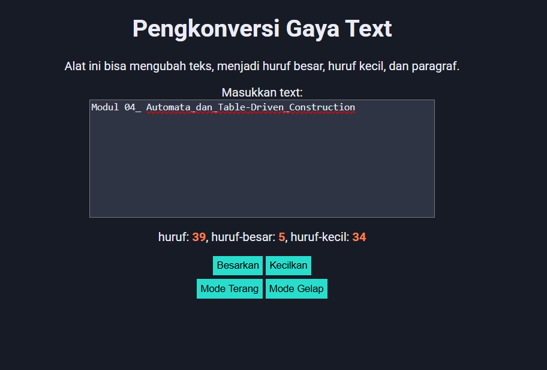

# TUGAS PENDAHULUAN MODUL 04
--
**Nama:** Ahmad Dhani Ibrahim
**NIM:** 103122400058
**Kelas:** SE-08-02

## Soal
ambahkan mode gelap sekaligus untuk editor-kecil dan tombol-tombolnya. Ketentuan warna untuk latar belakang editor-kecil adalah #2e3443, sementara untuk tombol adalah #29ddcc. Teks untuk tombol tetap mengikuti warna teks sebelumnya.

Untuk menghapus pinggiran tombol, nyatakan properti border untuk tidak ditunjukkan.

## Source code:
[index.html](./index.html)
[index.css](./index.css)
[index.js](./index.js)

## Pengerjaan
Pertama, saya menambahkan 2 button baru guna untuk  lightMode dan darkMode
```html
<div class="grup-tg">
        <button id="tombol-terang">Mode Terang</button>
        <button id="tombol-gelap">Mode Gelap</button>
    </div>
```

lalu saya styling [index.css](./index.css) nya untuk mengubah semua latarbelakang menjadi darkMode 
```css
.mode-gelap {
    background-color: #171b25;
    color: #EBECF7;
}

.mode-gelap .kotak-input {
    background-color: #2e3443;
    color: #EBECF7;    
}
```

Setelah itu saya mengubah warna button menjadi warna yang ditentukan = #29ddcc;
```css
.mode-gelap  button {
    background-color: #29ddcc;
    
}
```
saya menghapus border dan mengatur button supaya tidak saling berhimpitan
```css
.grup-tg{
    margin: 5px;
}

button {
    padding: 5px;
    border: none;
}
```
Lalu supaya button tersebut bisa digunakan, kita hubungkan class button yang ada di html kedalam [index.js](./index.js)
```js
const buttonLightElement = document.getElementById("tombol-terang");
const buttonDarkElement = document.getElementById("tombol-gelap");
```

Tambahkan listener supaya saat button diclick, maka tampilan akan berubah
```js
const buttonLightElement = document.getElementById("tombol-terang");
const buttonDarkElement = document.getElementById("tombol-gelap");
```

maka hasilnya akan seperti ini
## Output


## TERIMA KASIH!!
