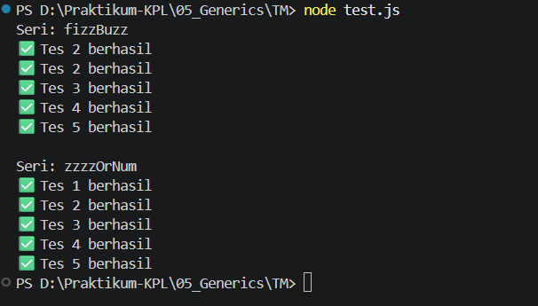

# TUGAS MANDIRI : GENERIC
**Nama:** Ahmad Dhani Ibrahim
**Kelas:** SE-08-02
**NIM:** 103122400058

## Soal
Diberikan program index.js seperti ini:
```js
// Tambah JSDoc di sini
function zzzzOrNum(value) {
    // Ubah kode di sini
}

// Tambah JSDOC di sini
function fizzBuzz(sequence) {
    // Ubah kode di sini

    const newSequence = sequence.map((e) => zzzzOrNum(e));

    return newSequence;
}

module.exports = {
    fizzBuzz: fizzBuzz,
    zzzzOrNum: zzzzOrNum,
};
```
Aturan FizzBuzz kali ini adalah:

1. Fungsi `fizzBuzz` hanya menerima larik yang semua elemennya terdiri dari bilangan bulat dan mengeluarkan larik pula yang bisa jadi bercampur string dan bilangan
2. Fungsi zzzzOrNum hanya menerima sebuah data tunggal berupa bilangan bulat dan mengembalikan "Fizz", "FizzBuzz", "Buzz", atau bilanga bulat sesuai logikanya
3. Kedua fungsi harus ada dan harus disertai JSDoc sesuai tipe data yang disiratkan dari no. 1, no. 2, dan perilaku yang diharapkan di bawah
4. fizzBuzz harus menggunakan fungsi zzzzOrNum di dalamnya

Gunakan konfigurasi ini untuk tsconfig.json dan test.js ini untuk menguji kode yang kamu buat.

## Source Code
[fizz.js](./fizz.js)

## Penyelesaian
Pada program ini, saya membuat 2 fungsi utama yaitu `zzzzOrNum` dan `fizzBuzz`untuk menerapkan logika FizzBuzz dengan standar keamanan yang ketat.

Fungsi `zzzzOrNum` berfungsi untuk mengolah nilai satuan, diawalan, di bagian awal, diterapkan pengecekan menggunakan typeof guna memastikan inputnya harus berupa angka, jika gak valid, maka fungsi bakal mengirimkan eror. Setelah lolos validasi, maka fungsi akan menggunakan akumulasi string dimana jika angka merupakan kelipatan 3, maka akan ditambahkan`'fizz'`, dan ketika kelipatan 5, maka akan ditambahkan `'Buzz'`. Jika inputan bukan merupakan kelipatan keduanya, maka nilai asli dari inputan akan dikembalikan..

Fungsi `fizzBuzz` digunakan untuk memproses data dalam bentuk array. Fungsi ini akan memastikan input yang diberikan berupa array. Untuk efisiensi prose, saya pakai metode `.map` untuk memanggil fungsi `zzzOrNum` pada setiap elemen didalamnya. Dengan metode ini, validasi tipe data dan transformasi nilai terjadi secara bersamaan, sehingga menghasilkan array baru sesusai dengan kontrak tipe data pada JSDoc.

## Output


## TERIMA KASIH!!!