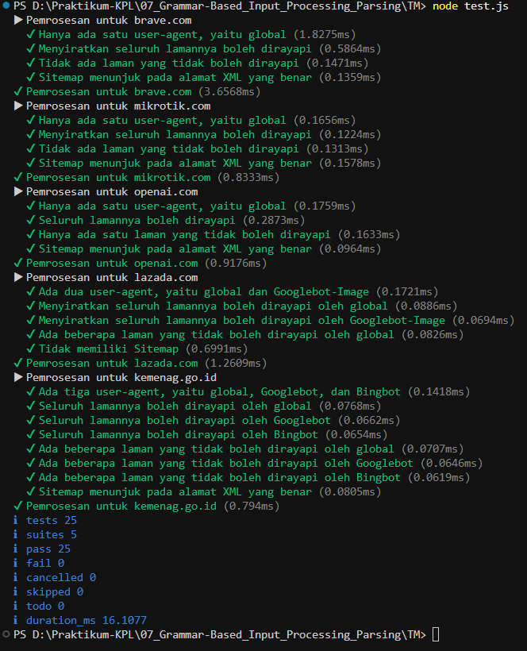

# TUGAS MANDIRI

**Nama:** Ahmad Dhani Ibrahim
**Kelas:** SE-08-02
**NIM:** 103122400058

## SOAL
Uraikan robot!

Tugas pada kesempatan kali ini adalah membuat fungsi yang menguraikan isi robots.txt menjadi POJO (plain old JavaScript object). Empat properti yang perlu diuraikan dijabarkan di bawah berikut.

User-agent adalah nama robot perayapnya
Allow adalah daftar halaman-halaman yang boleh dirayap
Disallow adalah daftar halaman-halaman yang tidak boleh dirayap
Sitemap adalah sebuah pranala yang menunjuk pada "denah" situs web (biasanya berformat XML)
Kamu akan mengerjakannya di dalam sebuah fungsi bernama parseRobots di index.js dan. Buka direktori 07 di sini untuk mengunduh berkas yang dimaksud, berkas-berikas robots.txt di dalam direktori daftar, dan berkas pengujiannya yaitu test.js.

## SOURCE CODE
[index.js](./index.js)

## PENYELESAIAN
Jadi pada program index,js terdapat fungsi `parseRobot(text)` yang menerima parameter berupa string text dari file `.txt` seperti daftar user-agents, halaman yang boleh dikunjungi (Allow), dan halaman yang dilarang dikunjungi(Disallow), serta alamat Sitemap.
Selain itu, program ini juga mempunyai tugas memisahkan tiap baris teks, mengenali jenis teks pada file `.txt`, lalu menyimpan hasilnya kedalam objek agar mudah digunakan untuk proses testing, pengolahan data, dan lainnya.

Hasil akhir dari program index.js adalah file `.txt` yang nantinya dapat diproses di file test.js

## OUTPUT

## TERIMA KASIH!!!!!