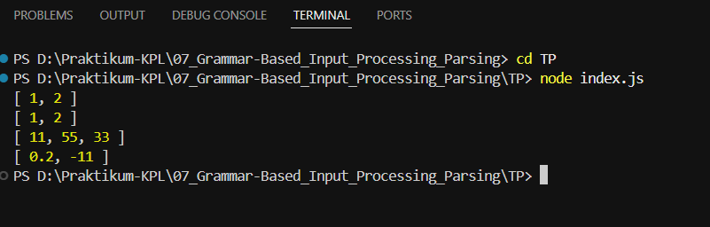

# TUGAS PENDAHULUAN : Grammar-Based Input Processing Parsing

**Nama:** Ahmad Dhani Ibrahim
**Kelas:** SE-08-02
**NIM:** 103122400058

## TUGAS
Buatlah fungsi yang mengubah deretan angka bertipe string menjadi larik angka.
```js
function toNumberArray(number) {
  // TODO
}

console.log(toNumberArray("1, 2")) // [1, 2]
console.log(toNumberArray(["1", "2"])) // [1, 2]
console.log(toNumberArray(" 11,55,33   ")) // [11, 55, 33]
console.log(toNumberArray(["0.2", "-11", "abc23"])) // [0.2, -11]
```

## SOURCE CODE
[index.js](./index.js)


## PENYELESAIAN

Terdapat function `toNumberArray` yang digunakan untuk mengubah data input menjadi array dengan tipe number. 

Di awalan saya buat variable arr dengan tipe data array yang tidak ada nilainya / kosong guna menampung data sementara. 
Lalu saya membuat kondiional dimana jika input memiliki tipe data string maka `split(",")` akan memisahkan data berdasarkan koma dan meghassilkan array. 
Namun jika input berupa array, maka datanya langsung dimasukkan ke variable arr.
Lalu pada bagian return, saya menggunakan method `map()` guna melakukan perulangan untuk setiap elemen array. Setiap elemen diproses dengan trim() untuk menghapus spasi pada array. Selanjutnya metode `filter() untuk menyaring hasil konversinya, dan isNaN() akan ngecek apakah data yang dihasilkan berupa NaN atau bukan. Jika data berupa angka, maka akan dipertahankan. Jika tidak, maka akan dihapus. 

## OUTPUT



## TERIMA KASIH!!!!!!!!