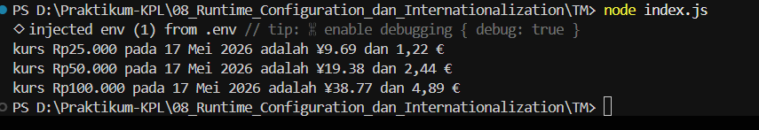

# TUGAS MANDIRI : Runtime Configuration dan Internationalization

**Nama:** Ahmad Dhani Ibrahim
**Kelas:** SE-08-02
**NIM:** 103122400058

## SOAL
Waktunya menukar uang!

Pada tugas ini kamu akan membuat program yang menampilkan kurs rupiah (IDR) terhadap renminbi luar Tiongkok (CNH) dan euro (EUR). Gunakan link API ini untuk mengambil data.

## SOURCE CODE
[index.js](./index.js)

## PENYELESAIAN
Program ini berfungsi untuk mengambil data nilai tukar mata uang secara real-time melalui API yang sudah disimpan di file `.env`, kemudian mengkonversi uang rupiah ke mata uang CNH(china), dan EUR(Euro).  
Saya membuat function `cekKurs(uang)` untuk menerima input jumlah uang dalam rupiah, lalu dikonversi ke mata uang lain. Didalam function tersebut terdapat `fetch()` yang digunakan untuk mengambil data kurs dari API dan mengubah data tsb jadi object menggunakan `response.json()`.
Lalu program akan menghitung hasil konversi rupiah ke CNH maupun EUR dgn cara mengalikan nominal uang dengan nilai kurs yg diperoleh dr API. Setelah itu, hasinya akan diformat menggunakan Intl.NumberFormat supaya tampilann mata uangnya ngikutin format internasional sesuai locale masing" negara. 
Lalu program juga menggunakan format `Intl.DateTimeFormat untuk nampilkan tanggal sesuai format indonesia berdasarkan waktu pada sistem perangkat yang digunakan.   
## OUTPUT
