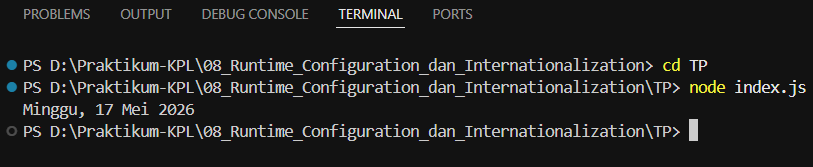

# TUGAS PENDAHULUAN : Runtime Configuration dan Internationalization

**Nama:** Ahmad Dhani Ibrahim
**Kelas:** SE-08-02
**NIM:** 103122400058

## SOAL
Tampilkan tanggal sekarang dengan format seperti ini:
```txt
Sabtu, 18 April 2026
```
Nilai waktu tidak harus sama, asalkan formatnya benar dan bisa tampil di komputer terpisah pada waktu tertentu. Gunakan Intl.DateTimeFormat (bukan string manual).

## SOURCE CODE
[index.js](./index.js)

## PENYELESAIAN
Saya membuat function bernama tanggal untuk menempilkan tanggal secara realtime sesuai waktu pada perangkat yang digunakan saat kita running. 
Pada function `tanggal()`, saya membuat object date menggunakan `new Date` untuk mengambil tanggal dan waktu saat ini dari sistem perangkat yang digunakan. Lalu saya menggunakan  `Intl.DateTimeFotmat()` dengan "id-ID" supaya mengikuti format waktu Indonesia. 
Terdapat:
- `weekday: "long"` = untuk menampilkan format hari
- `day: "numeric"` = untuk menampilkan tanggal
- `month: "long"` = untuk menampilkan bulan
- `year: "numeric"` = untuk menampilkan tahun

Setelah itu output akan menyesuaikan sesuai formatnya yaitu:



## TERIMA KASIH!!!!!!

