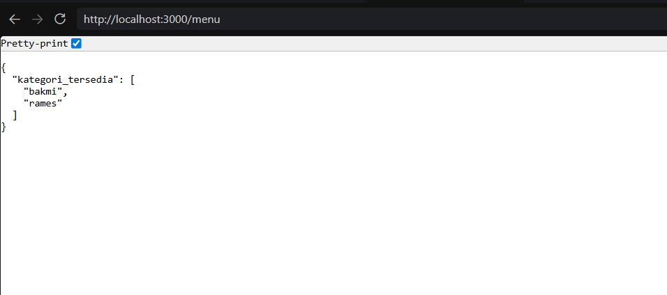

# TUGAS PENDAHULUAN : API Design dan Construction Using Swagger

**Nama:** Ahmad Dhani Ibrahim
**Kelas:** SE-08-02
**NIM:** 103122400058

## SOAL 
Buatlah satu endpoint lagi beserta dokumentasi OpenAPI-nya, yaitu GET /menu yang menampilkan daftar semua nama kategori menu yang ada.

## SOURCE CODE
[index.js](./index.js)

## PENYELESAIAN
Saya membuat endpoint `/menu` untuk menampilkan seluruh kategori menu yang terdaftar. Dibuat pakai method GET yang pastinya buat mengambil data tanpa melakukan perubahan pada data yang ada. Pada endpoint tersebut, saya memakai `Object.keys(menuData)` untuk mengambil seluruh nama kategori dari object menuData. Lalu hasil pengambilan data akan disimpan ke `kategori`, dan data dikirim melalui res.json() supaya ditampilkan dalam format JSON 

## OUTPUT

## TERIMA KASIH!!!!!