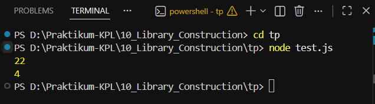

# TUGAS PENDAHULUAN : Library Construction

**Nama:** Ahmad Dhani Ibrahim

**Kelas:** SE-08-02

**NIM:** 103122400058

## SOAL
Buatlah pustaka JavaScript yang menyediakan utilitas berupa dua fungsi yang menghitung jumlah huruf dan jumlah kata.

Kriteria:

- Hanya alfabet A hingga Z yang dihitung (besar dan kecil)
- Spasi tidak dihitung
- Pustaka bisa diimpor

## Source Code
[index.js](./index.js) 
[./test.js](test.js)

## Output

## Deskripsi
Program ini berfungsi sebagai library sederhana Javascript untuk menghitung jumlah huruf dan jumlah kata pada sebuah teks. Function `hitungHuruf()` digunakan untuk menghitung seluruh huruf alfhabet dari (A-Z) tanpa menghitung spasi dan angka. Sedangkan function `hitungKata()` digunakan untuk menghitung jumlah kata yang hanya terdiri dari huruf alfhabet. Pustakanya saya buat menggunakan module.exports supaya dpt diimpor dan digunakan ke file lain. 