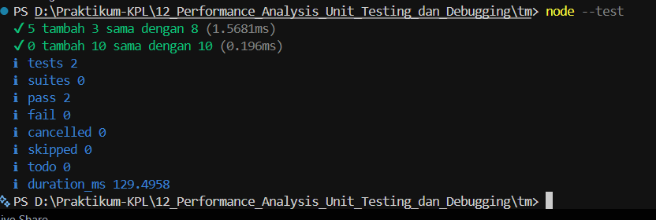

# TUGAS PENDAHULUAN : Performance Analysis, Unit Testing, dan Debugging

**Nama:** Ahmad Dhani Ibrahim

**Kelas:** SE-08-02

**NIM:** 103122400058

## Source Code
[hitung.js](./hitung.js)
[hitung.test.js](./hitung.test.js)

## Output


## Soal
Tambah dan tambah!

Fungsi di bawah ini melakukan penjumlaha pada penghitung (counter), yang sesederhana menambahk jumlah jika kamu menekan tombol.

`hitung.js`
```js
function tambahPengitung(terkini, jumlah) {
  terkini = terkini + jumlah;
  return terkini;
}
```

`hitung.test.js`
```js
import { test } from 'node:test';
import assert from 'node:assert';
import { tambahPengitung } from './hitung.js';

test('5 tambah 3 sama dengan 8', () => {
  assert.strictEqual(tambahPengitung(5, 3), 8);
});

test('0 tambah 10 sama dengan 10', () => {
  assert.strictEqual(tambahPengitung(0, 10), 10);
});
```
Bisakah kamu tunjukkan apakah kode sudah benar atau bagian mana yang perlu diperbaiki beserta alasannya?

## Desktipsi
Berdasarkan kode yang diberikan, sebenrnya fungsi `tambahPengitung()` telah memiliki logika penjumlahan yang benar dan mampu menghasilkan keluaran sesuai dengan test case yang disediakan. Namun, terdapat beberapa perbaikan yang dapat dilakukan yaitu dengan menambahkan `export` pada fungsi `tambahPengitung()` di berkas `hitung.js` karena fungsi tersebut diimpor pada `hitung.test.js` menggunakan sintaks `import`. Tanpa `export`, proses pengujian tidak dapat dijalankan karena fungsi tidak dapat ditemukan oleh modul lain.
```js
export function tambahPengitung(terkini, jumlah) {
}
```
Lalu saya juga menambahkan validasi tipe data untuk memastikan parameter yang diterima berupa angka. 
```js
if (typeof terkini !== "number" || typeof jumlah !== "number") {
    throw new Error("Parameter harus berupa angka");
  }
```
Lalu penulisan ini dapat disederhanakan:
```js
terkini = terkini + jumlah;
  return terkini;
```
Menjadi:
```js
return terkini + jumlah;
```
Dengan demikian, fungsi tersebut tidak hanya dapat diggunakan pada proses pengujian, tapi juga jadi lebih andal dan sesuai dgn praktik pengembangan perangkat lunak yang baik.