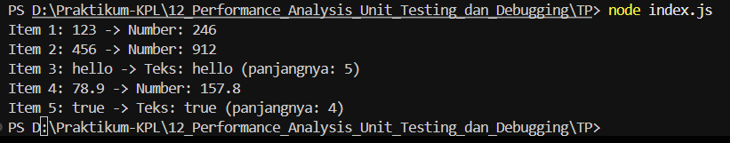

# TUGAS PENDAHULUAN : Performance Analysis, Unit Testing, dan Debugging

**Nama:** Ahmad Dhani Ibrahim

**Kelas:** SE-08-02

**NIM:** 103122400058

## Source Code
[indes.js](./index.js)

## Soal
Cobalah untuk menangkap kecacatan dalam kode ini
```js
function main() {
  const data = [
    "123",
    456,
    "hello",
    78.9,
    true,
  ];

  for (let i = 0; i < data.length; i++) {
    const result = processData(data[i]);
    console.log(`Item ${i + 1}: ${data[i]} -> ${result}`);
  }
}

function processData(data) {
  const str = data.toLowerCase();
  const num = parseInt(str);
  if (!isNaN(num) && str === String(num)) {
    return `Number: ${num * 2}`;
  }
  return `Teks: ${str} (panjangnya: ${str.length})`;
}

main();
```

## Output


## Deskripsi
Ada beberapa masalah dalam code sebelumnya yaitu:

1. Error saat memanggil toLowerCase()

Pada fungsi `processData()`:
```js
const str = data.toLowerCase();
```
Method `toLowerCase()` hanya bisa digunakan pada tipe data string.

Namun pada array data terdapat:
```js
456
78.9
true
```
yang bertipe number dan boolean.

Akibatnya saat program memproses elemen kedua (456), akan muncul error:
```Json
TypeError: data.toLowerCase is not a function
```
2. Program berhenti sebelum seluruh data diproses

Karena error tersebut tidak ditangani menggunakan `try...catch`, program langsung berhenti dan item setelahnya tidak akan diproses.

3. Tidak ada validasi tipe data

Fungsi `processData()` mengasumsikan semua input adalah string. Seharusnya dilakukan pengecekan terlebih dahulu

4. Kehilangan informasi tipe data asli

Nilai numerik seperti:
```js
456
78.9
```
diperlakukan seolah-olah string yang akan diubah ke huruf kecil, padahal sebenarnya merupakan angka. Logika program tidak mempertimbangkan berbagai tipe data yang ada dalam array.

## PENYELESAIAN
Untuk memperbaiki masalah tersebut, saya mengubah data menjadi string dulu pakai `String(data)` sebelum memanggil `toLowerCase()`. Selain itu, saya menambahkan `try...catch` agar program tidak langsung berhenti apabila terjadi error saat pemrosesan data. Saya juga nambahkan pengecekan pakai `isNaN()` untuk membedakan data numerik dan non-numerik. Dengan perbaikan ini, program dapat memproses seluruh data pada array dengan aman dan menghasilkan output yang sesuai tanpa mengalami kegagalan saat dijalankan.